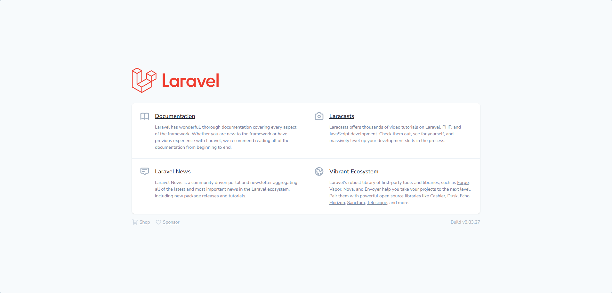

# Host your Laravel project on a shared hosting service

## First create your project locally

Deploy you project as you would usually do locally following the installation guide for you Laravel version, for example for Laravel 8, which is the version that is supported for shared hosting running PHP 7.4 would be as described at: https://laravel.com/docs/8.x#installation-via-composer

## Create a zip file with your project files

In your local machine just create a zip package containing your application files, or just go ahead and compress your project folder.

## Upload zip package to your shared hosting account

Log in to your shared hosting account and access cPanel, in cPanel access File Manager and create a new folder in your top account level.

For example if you create a folder named "laravel" in your account top level, it could be located in '/home/youraccount/laravel'.

Access your project folder and just use the built-in uploader to upload the zip file, once uploaded, just right click on the file and you will find and extract/descompress option, it will add your project files to this new folder.

For example in your top level folder, you may have the following folder structure

```bash
laravel/
├─ app/
│  ├─ app/
│  ├─ bootstrap/
│  ├─ config/
│  ├─ database/
│  ├─ public/
│  ├─ resources/
│  ├─ routes/
│  ├─ storage/
│  ├─ tests/
│  ├─ vendor/
```

## Move public files

In your account folders locate the public_html folder which is the folder that is accessible through web requests and will be the folder that will serve the website and application.

From your application folder you will need to upload or copy the public folder files there. In my implementation Laravel is used in the backend as an API with the database, then I am saving the public files from the Laravel project to an '/api' folder.

In the public_html folder you may end up with a folder structure as follows:

```bash
public_html/
├─ app/
│  ├─ .htaccess
│  ├─ favicon.ico
│  ├─ index.php
│  ├─ robots.txt
│  ├─ web.config
```

## Update your .env file

In the protected Laravel folder update the application settings to your account settings. If you don't see the .env file available in cPanel file manager, you can edit it locally and upload it through FTP, or you can click on the settings options at the top of the cPanel file manager and enable the "show hidden files" option and update the settings directly in cPanel.

A few lines should be updated for example:
```bash
APP_URL=https://mywebsite.com/app/

DB_CONNECTION=mysql
DB_HOST=localhost
DB_PORT=3306
DB_DATABASE=MyDatabaseName
DB_USERNAME=MyDatabaseUser
DB_PASSWORD=MyDatabasePassword
```
Just replace with your own values.

## Update index.php in public folder

Since public Laravel application files are in the /api subfolder, just go and update the index.php file located there.

The routes there should reference the location of the application files that are at the top level of the shared hosting account.

In index.php update the lines:

```php
require __DIR__.'/../vendor/autoload.php';
...
$app = require_once __DIR__.'/../bootstrap/app.php';
...
```

to:
```php
require __DIR__.'/../../../laravel/app/vendor/autoload.php';
...
$app = require_once __DIR__.'/../../../laravel/app/bootstrap/app.php';
...
```

Adjust the location with your own project structure, please notice the above follows the project structure for this specific implementation.

## Test your application

Finally, it you want to test if everything is right, just access your public URL for example: https://yourwebsite.com/app 

If you get the Laravel landing page, you got it right, if you don't just go and check in the error log file in your public folder and check if you got the right path.



## Note

Please notice, this shows just the initial Laravel install, if you have your application ready, you need to migrate your database and since you may not be able to run the php artisan commands, you may have to manually upload your DB export in your hosting database.